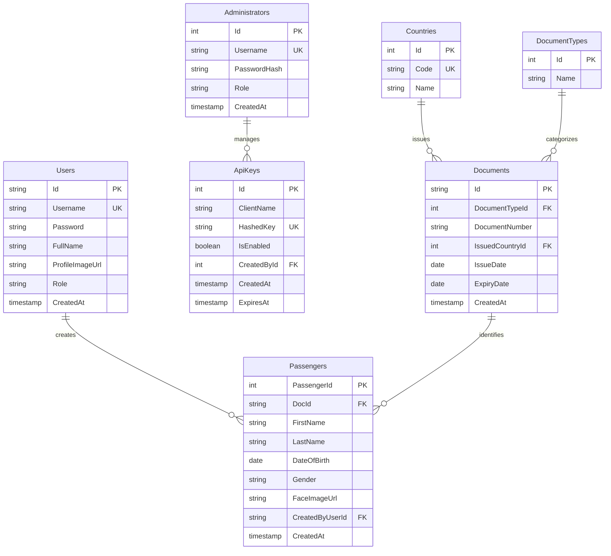

# Database ERD - Interview Backend

This document contains the Entity Relationship Diagram (ERD) for the database schema defined in `init.sql`.

## ER Diagram (Mermaid)

## Entity Descriptions

### 1. Users
Stores the system users who are authorized to manage passenger data.
- **Id**: Unique identifier (using ULID/String format).
- **Role**: Determines permissions (Default: 'User').

### 2. Administrators
Internal administrative accounts for system-level management.
- **PasswordHash**: BCrypt hashed credentials.

### 3. ApiKeys
Keys used for external system integrations.
- **CreatedById**: Links to the administrator who generated the key.

### 4. Passengers & Documents
The core business logic.
- **Documents**: Contains sensitive identification data, isolated from the passenger's basic profile.
- **Passengers**: Linked to a document and a staff user who created the record.
